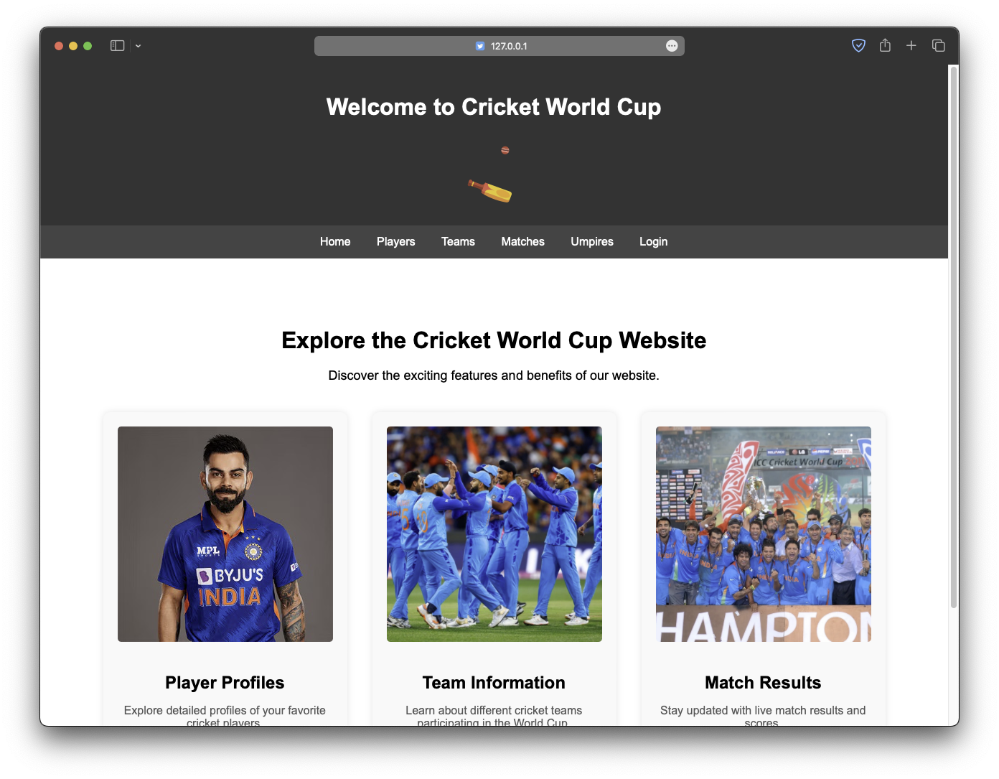
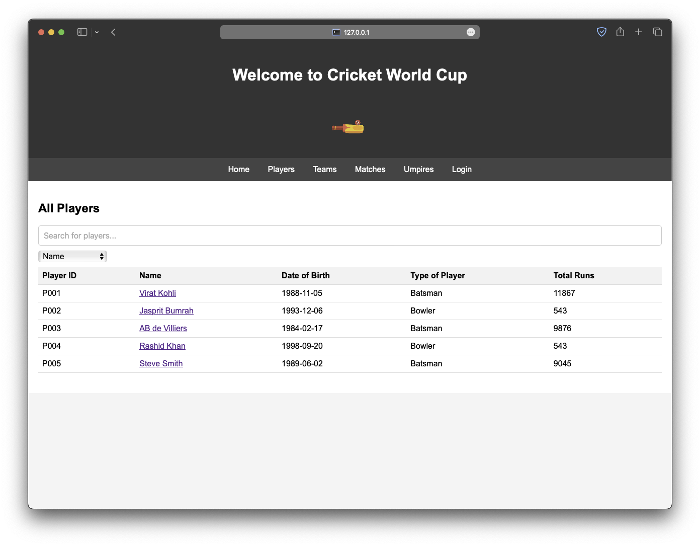
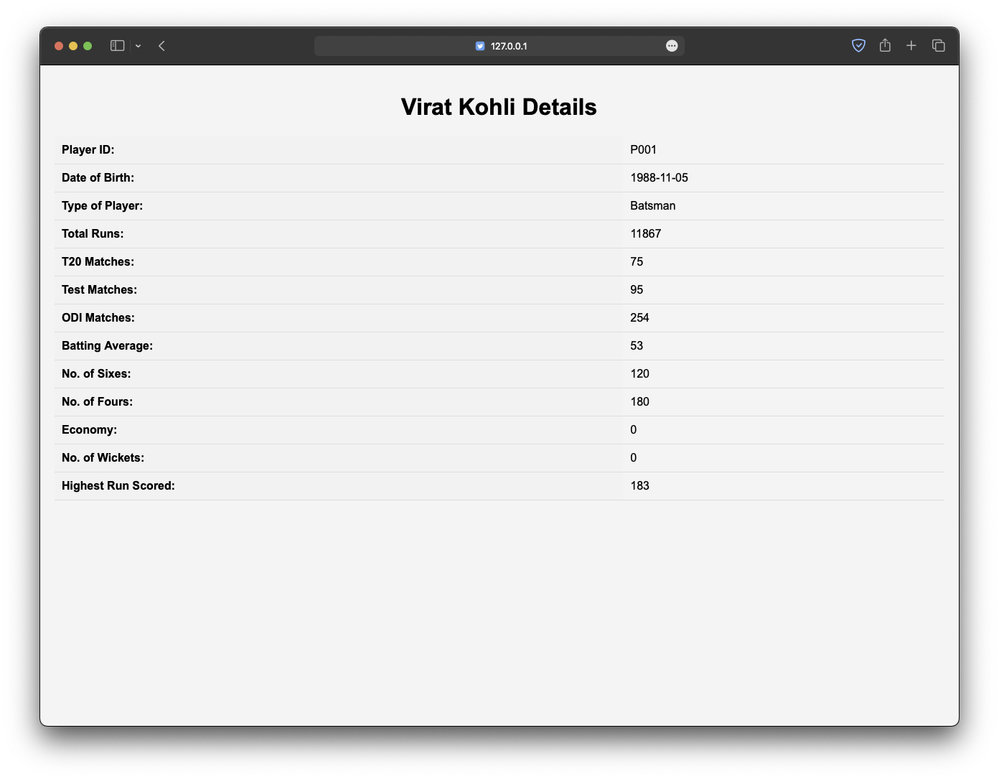

# Circket World Cup Database Management System

This is a database management system for a cricket world cup. The system is designed to store information about the teams, players, matches, and the tournament. The system is implemented using MySQL and Python.

## Table of Contents

- [Screenshots](#screenshots)
- [Features](#features)
- [Requirements](#requirements)
- [Usage](#usage)
- [Authors](#authors)

## Screenshots



| All Players | Player's Details |
| --- | --- |
|  |  |

## Features

1. Add, update, and delete teams
2. Add, update, and delete players
3. Add, update, and delete matches
4. Add, update, and delete tournament
5. View team details
6. View player details
7. View match details
8. View tournament details
9. View team performance
10. View player performance
11. View match results
12. View tournament schedule

## Requirements

1. MySQL
2. Python
3. MySQL Connector for Python

## Usage

1. Create a new database in MySQL
2. Import the `cricket_world_cup.sql` file to create the tables
3. Create the database connection details in `config.py`
    ```python
    db_config = {
        "host": "localhost",
        "user": "root",
        "password": "password",
        "database": "cricketwc",
    }
    ```
4. Run the `app.py` file

> Note: Admin credentials are hardcoded in the `app.py` file

```txt
username: admin
password: admin
```

---

```bash
python -m venv venv
source venv/bin/activate
pip install -r requirements.txt
python app.py
```

## Authors

- [**Mantresh Khurana**](https://github.com/mantreshkhurana)
